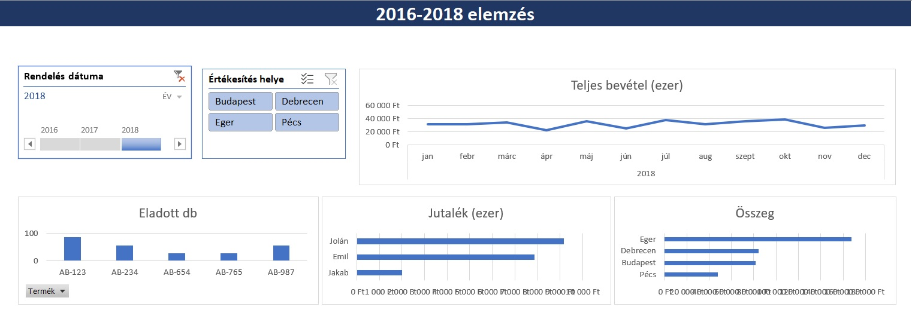

# Sales Performance Dashboard | Excel

## Project Overview

This project demonstrates sales data analysis and interactive dashboard creation in Microsoft Excel.

The dashboard provides an overview of sales performance across different time periods, locations and products, allowing users to analyze revenue, sales volume and commission metrics.

## Dashboard Features

- Revenue analysis over time
- Sales performance by location
- Product-level sales analysis
- Sales volume comparison
- Commission analysis
- Interactive filtering by year and location
- Time-based filtering using a timeline

## Tools Used

- Microsoft Excel
- PivotTables
- PivotCharts
- Slicers
- Timeline
- Data visualization

## Dashboard Preview

## Project Files

- `Kimutatas_dashboard.xlsx` – Excel workbook containing the analysis and interactive dashboard
- `kimutatas_dasboard.jpg` – dashboard preview

## Purpose

The purpose of this project was to analyze structured sales data and create an interactive Excel dashboard that presents key business performance indicators in a clear and accessible format.
